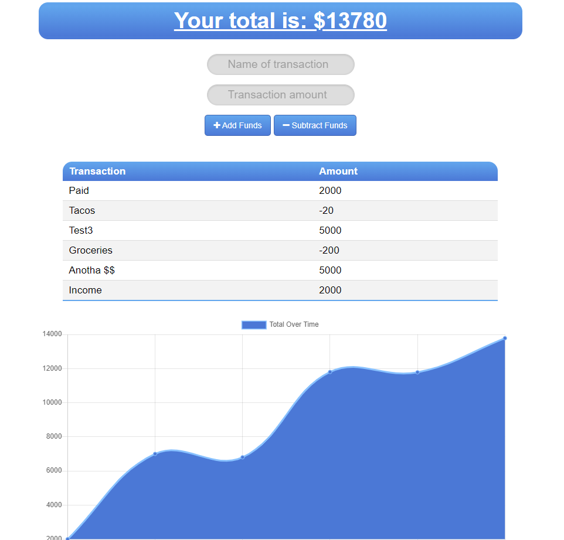

# Budget Tracker PWA

## Links:

Deployed Application: https://enigmatic-scrubland-28964.herokuapp.com/  
Repository: https://github.com/mbussert/budget-tracker

## Description:

Provides users with a fast and easy way to track their money. Includes offline functionality so that the application is useable without data or an internet connection.

## Table of Contents:

- [Installation](#installation)
- [Usage](#usage)
- [License](#license)
- [Contributing](#contributing)
- [Testing](#tests)
- [Contact](#contact)

## Installation:

A user navigates to the deployed application URL and can then install the application on their smart device.

## Usage:

As a progressive web application (PWA), a user can install this application on their smart phone or tablet and even use it offline. Enter either credits or debits to your personal budget and track purchases with ease.

## License:

This application is covered under the MIT License.

## Contributing:

Users are free to contribute to this project.

## Tests:

No tests have been created for this application.

## Questions:

GitHub: [mbussert](https://github.com/mbussert)  
 By Email: [mbussert@gmail.com](mailto:mbussert@gmail.com)
